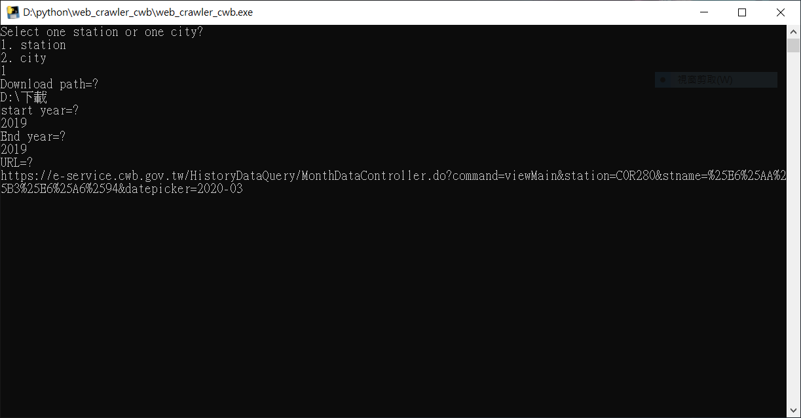

# 中央氣象局觀測資料月報表下載工具

**本程式針對氣象局月報表下載，日報表與年報表並不適用**  
**使用時請將chromedriver與本程式放在同位置，記得下載與chrome版本相符的**  
* [chromedriver載點](https://chromedriver.chromium.org/)
  
## 使用參數說明
1. station/city，這邊選擇1表示目標為單一測站，選擇2為某縣市內的所有測站  
2. Download path，鍵入欲下載的路徑(如:D:\下載)，記得使用倒斜線  
3. Start year，起始年份(西元)  
4. End year，終止年份(西元)，可與起始年份相同，即表示下載1年的資料  
5. URL，報表資料的網址，下載單一測站需要該測站的任一月報表網址，下載某縣市內所有測站需要該縣市的任一測站月報表網址
  
### 程式截圖

